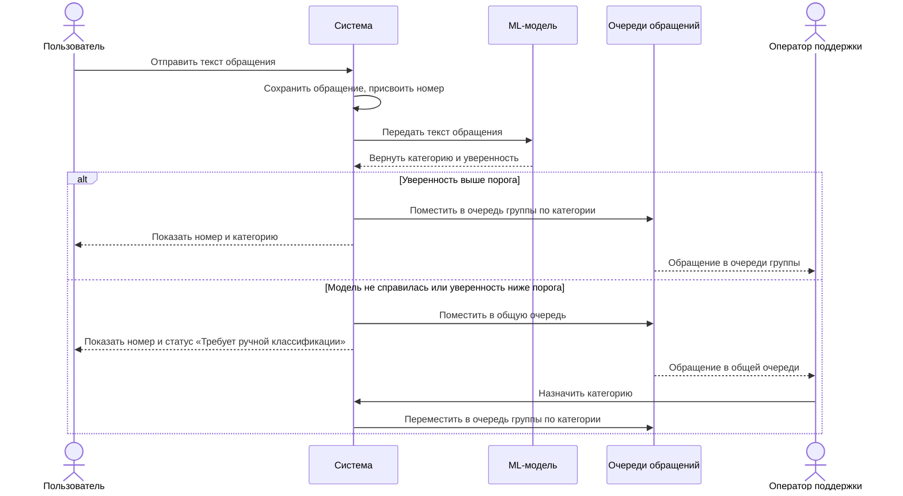

# Диаграммы

## Диаграмма последовательности

Диаграмма показывает выполнение сценария
[UC-01. Классификация и направление обращения](requirements.md#uc-01).

```mermaid
sequenceDiagram
    actor User as Пользователь
    participant System as Система
    participant Model as ML-модель
    participant Queue as Очереди обращений
    actor Operator as Оператор поддержки

    User->>System: Отправить текст обращения
    System->>System: Сохранить обращение, присвоить номер
    System->>Model: Передать текст обращения
    Model-->>System: Вернуть категорию и уверенность

    alt Уверенность выше порога
        System->>Queue: Поместить в очередь группы по категории
        System-->>User: Показать номер и категорию
        Queue-->>Operator: Обращение в очереди группы
    else Модель не справилась или уверенность ниже порога
        System->>Queue: Поместить в общую очередь
        System-->>User: Показать номер и статус «Требует ручной классификации»
        Queue-->>Operator: Обращение в общей очереди
        Operator->>System: Назначить категорию
        System->>Queue: Переместить в очередь группы по категории
    end
```
